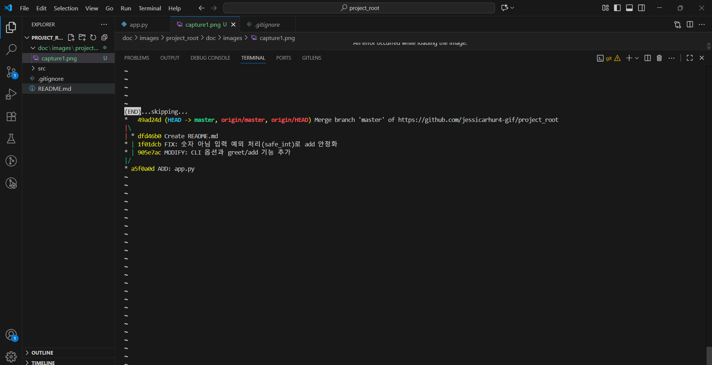
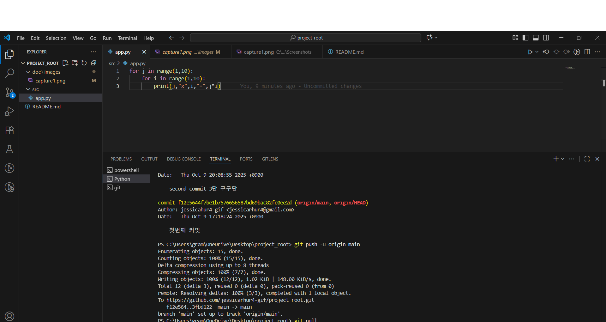

🧾 과제 수행 기록
이번 과제에서 다음 Git 명령어를 사용하였다.

- `git init` : 로컬 저장소 초기화  
- `git add .` : 모든 파일 스테이징  
- `git commit` : 변경 사항 커밋  
- `git push` : 원격 저장소(GitHub)로 업로드  
- `git pull` : 원격 저장소의 최신 버전 가져오기  
- `git log` : 커밋 기록 확인  
- `git status` : 현재 작업 트리 상태 확인

이대로 만들었습니다.
C:.
│  README.md
│  tree.txt
│  
├─doc
│  └─images
│          capture1.png
│          capture2.png
│          
└─src
        app.py
        
 🔗 GitHub Repository
[https://github.com/jessicarhur4-gif/project_root]

✍️ 작성자 정보
- **이름:** jessicarhur4-gif  
- **제출일:** 2025.10.09  
- **과제명:** Python Git/GitHub 실습 과제  
- **사용 환경:** VS Code, Git Bash, GitHub

💬 요약
이번 과제를 통해 Git의 기본 명령어(`git init`, `git add`, `git commit`, `git push`, `git pull`, `git status`, `git log`)를 실습하며  
로컬과 원격 저장소를 연동하는 과정을 이해하였다.  
또한, commit 규칙(ADD / MOD
IFY / FIX)을 적용하여 버전 관리의 기본 원리를 학습하였다.

